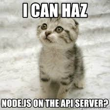

## About
Node.js is an open-source, cross-platform JavaScript runtime environment that allows developers to build and execute server-side applications using JavaScript. It was developed by Ryan Dahl and initially released in 2009.

Some of the key features in NodeJs include
- __JavaScript Runtime__: Node.js is built on the V8 JavaScript engine developed by Google. This engine compiles JavaScript code into native machine code, making it highly efficient and fast.

- __Event-Driven Architecture__: Node.js operates on an event-driven, non-blocking I/O model. This means that it can handle multiple connections simultaneously without waiting for one operation to complete before moving on to the next. This architecture is particularly well-suited for applications that require high concurrency, such as real-time applications and APIs.

- __Single-Threaded Event Loop:__ Node.js operates using a single-threaded event loop, which manages asynchronous operations efficiently. While Node.js itself is single-threaded, it can handle concurrent requests by offloading I/O operations to a separate thread pool.

## Resources
*Read or watch*:

1. [Node JS getting started](https://nodejs.org/en/docs/guides/getting-started-guide)
2. [Process API docs](https://node.readthedocs.io/en/latest/api/process/)
3. [Child process](https://nodejs.org/api/child_process.html)
4. [Express getting started](https://expressjs.com/en/starter/installing.html)
5. [Mocha documentation](https://mochajs.org/)
6. [Nodemon documentation]()

## Learning objectives

- [X] run javascript using NodeJS
- [X] use NodeJS modules
- [X] use specific Node JS module to read files
- [X] use process to access command line arguments and the environment
- [X] create a small HTTP server using Node JS
- [X] create a small HTTP server using Express JS
- [X] create advanced routes with Express JS
- [X] use ES6 with Node JS with Babel-node
- [X] use Nodemon to develop faster
